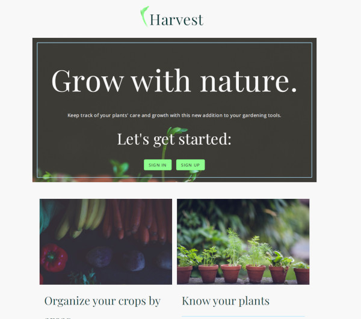
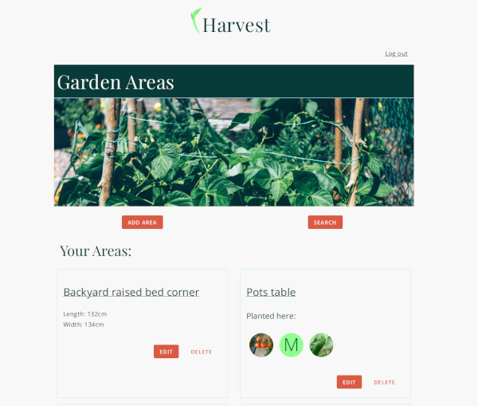
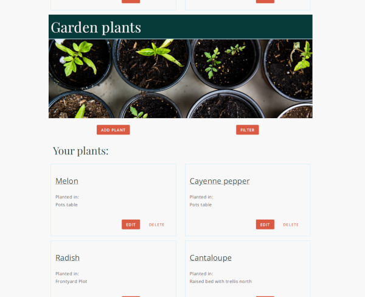
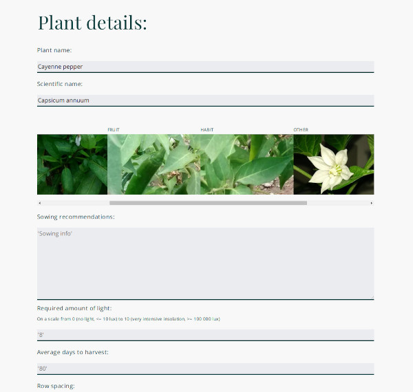

# 'Harvest'

[Live App](https://harvest-psi.vercel.app/).

## Description

'Harvest' is a tool to help users keep track of their garden's progress. The user can organize their garden by areas and save information about their plants with the option to look for plant data using an external API (trefle.io) or fill the plant's data themselves. The users can also save notes related to their garden or a specific plant or area.

## Further goals for this project

I would like to use the plant's data in useful ways like letting the user know when to expect their crops to be ready or how to distribute the space in their garden areas taking into account the plants' spread and growth.

## Screenshots
- Landing page

 

- Garden areas section

 

- Plants section

 

- Plant detail

 

## Summary
The client-side application combines our API with an external API to help the user gather data about their plants and shows images that can help identify plant species. It also allows the user to manage notes and areas.

## Built with
This project was made with React, Javascript and CSS.

## Server side repo:
[Harvest-api](https://github.com/wayfaringjou/harvest-api).
